#Managing Canvas App

Chatter Post from Visualforce pages or App Previewer or Chatter Tab provide a mechanism to connect to external applications, for example to provide a branded user experience or give additional capability for Visualforce pages. Data is captured into Chatter Feed using the Input field defined. In this Quick Start you will create a Visualforce page to post chatter feeds and upload some files to your Node JS server.

Use this example ([Node JS File Upload Example](https://github.com/sanchitdua/nodefileupload)) to run it via a Node JS server. You just need to download and install the Node Server for your preferred operating system. (from [here](https://nodejs.org/download/))

Navigate to your Node JS application (downloaded as zip from above) using terminal and issue the command `npm install`, this will install all the dependencies for the node application to execute.

##Step 1 Creating a Connected App and name it as Node_Canvas:

1. In your DE environment click **Setup**
2. Select **Create | Apps**
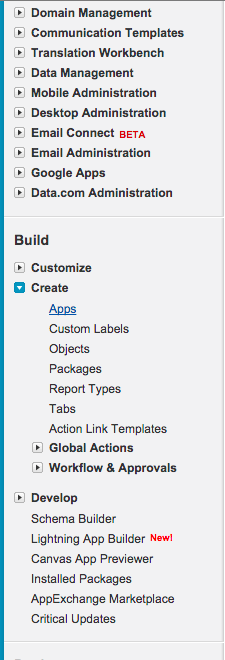
3. Click New Connected App button, enter **node_canvas** as App name, **<your_email_adress>** as Contact Email.
4. Select the checkbox "Enable OAuth Settings" and enter **https://localhost:8443** in Callback url.
5. From the picklist section Selected OAuth Scopes select **Full Access (full)** and **Access and manage your chatter data (chatter_api)**
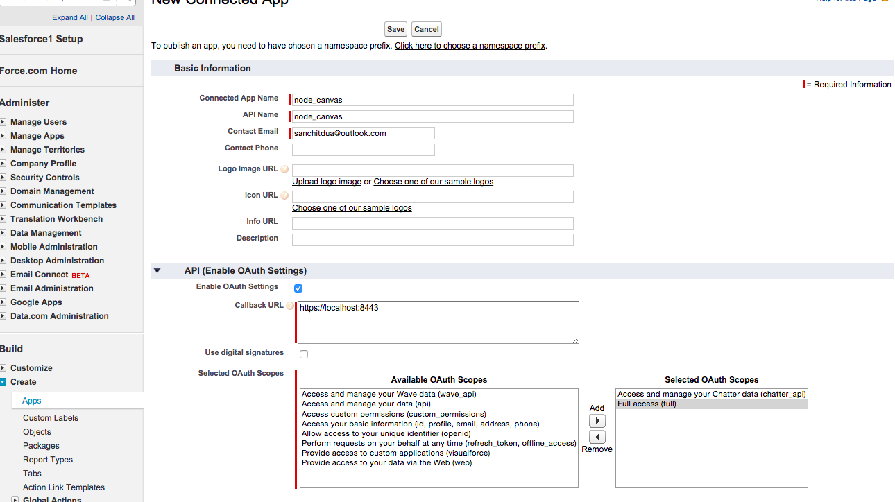
6. Under the Canvas App Settings, select Force.com Canvas checkbox and enter the url under Canvas App Url as **https://localhost:8443/authenticate** and select **chatter feed** **chatter tab** and **Visualforce page** from the Locations section.
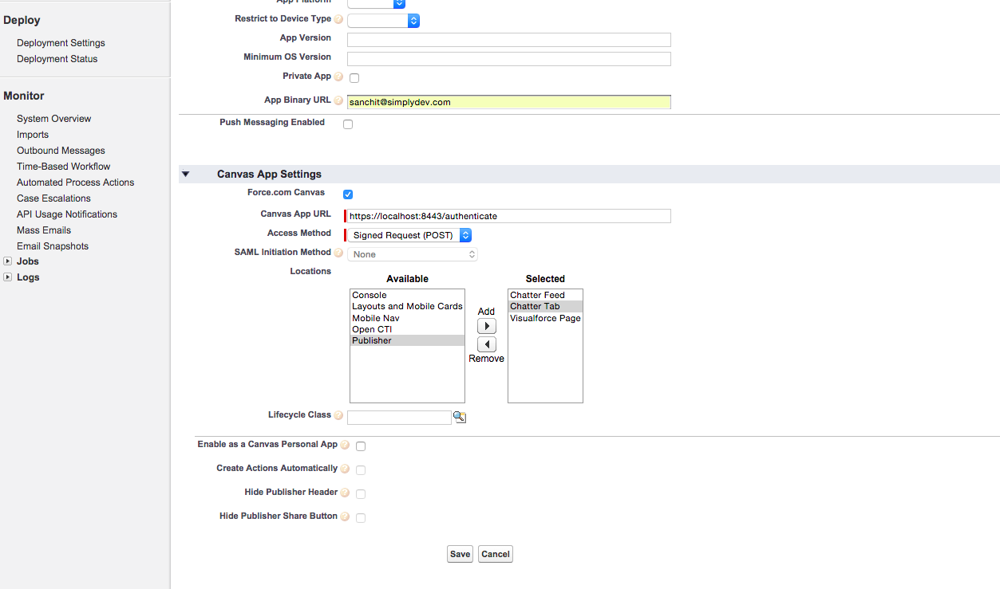
7. Now you will be able to see the Consumer Key, Consumer Secret and some settings for the application we did. Here, we will utilize the Consumer Secret in order to authenticate the Node application from Salesforce
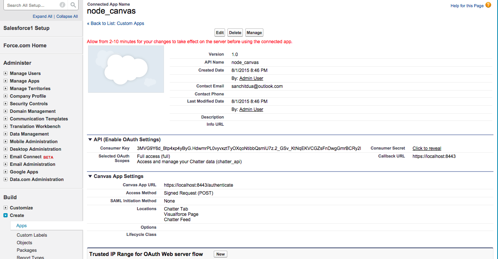
8. You need to click on the hyperlink in order to reveal the consumer secret, copy the consumer secret in your text editor for time being.
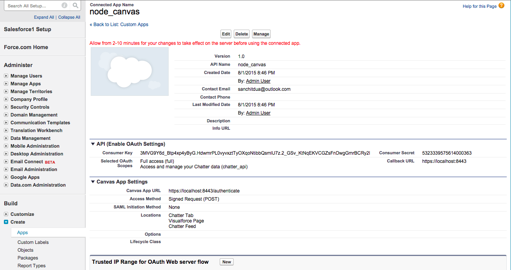
9. You neet to click on the manage button of the connected app, and click on the edit button to modify the details
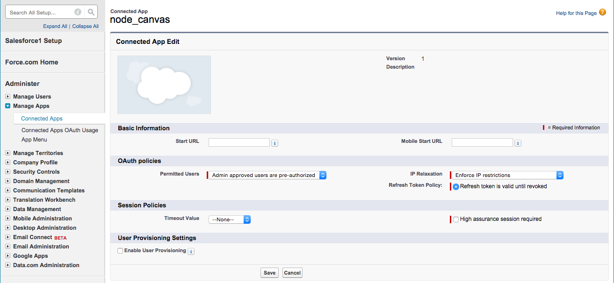
and click the **Save** button

> Force.com Canvas enables you to easily integrate a third-party application in Salesforce. Force.com Canvas is a set of tools and JavaScript APIs that you can use to expose an application as a canvas app. This means you can take your new or existing applications and make them available to your users as part of their Salesforce experience.

##Step 2 Starting the Node Server:

1. Before starting the Node server, make sure to set the Client Secret in Node JS application.
2. Open the configuration.js file and replace the CONSUMER_SECRET value after the assignment operator as

3. Start the Node Js server by issuing the `npm start` command from the terminal
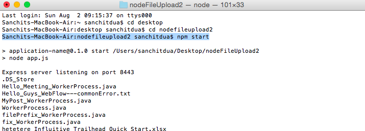

## Reviewing the Output on Canvas App Previewer / Chatter Tab / Visualforce page
Now we are ready to review our application via Canvas App Previewer, Chatter Tab or Visualforce Page

### **Canvas App Previewer:**
1. From Setup, click Canvas App Previewer.
2. Click your canvas app on the left-hand pane. The canvas app appears in the frame named **node_canvas**.
You will encounter the following screens
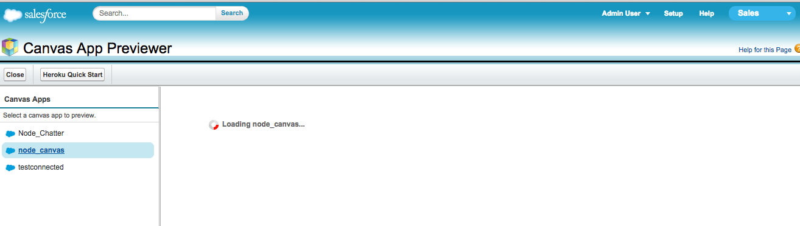
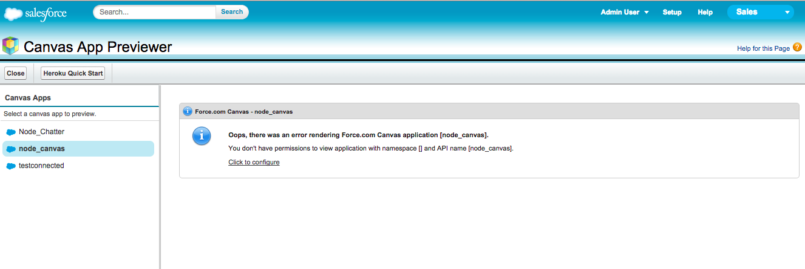
This is due to the permissions are not yet granted to applications we want to preview. To do that we may go for either enabling the connected app under current user's profile or click on the manage button of the connected app, and click on the "Manage Profiles" button and select the profile
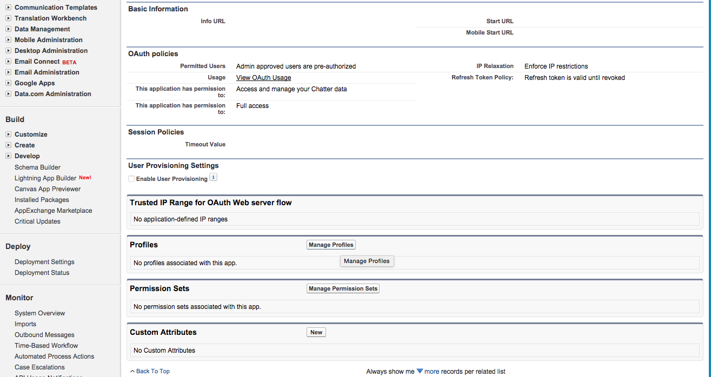
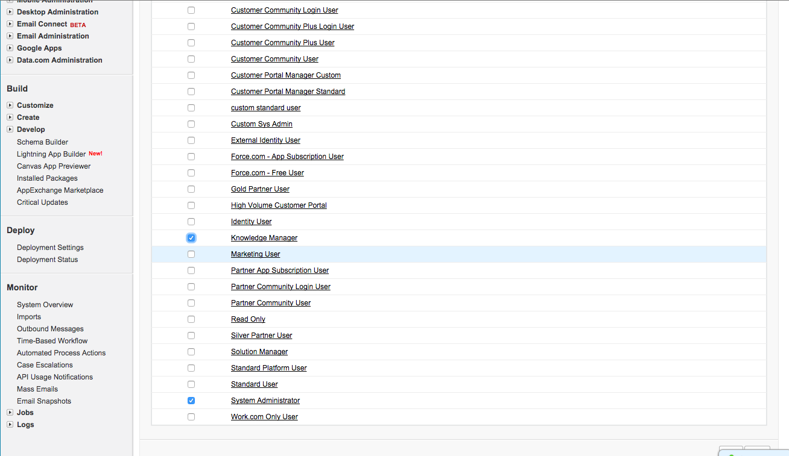
and click the **Save** button
3. Repeat the above two steps to preview the app under Canvas App Previewer and you will be able to preview it as
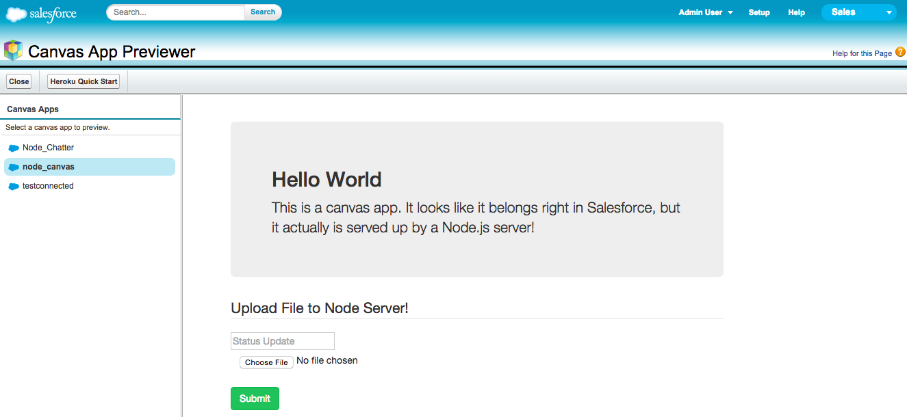
> Canvas App Previewer is a development tool that lets you see what your canvas apps will look like before you publish them. To view your canvas app:

### **Chatter Tab**
1. Make sure current user's chatter is enabled by reviewing Customize | Chatter | Settings | Enable
2. Go to the chatter tab Click your canvas app on the left-hand pane. The canvas app appears in the frame.
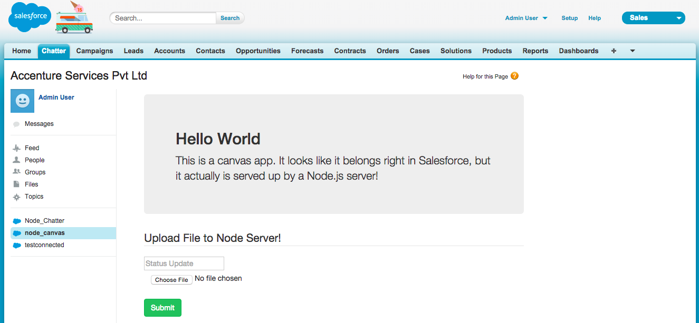
3. The text you will enter in the "Status Updates" field will create chatter post as well as description (prepended info) for the file you will select from "choose file" button.
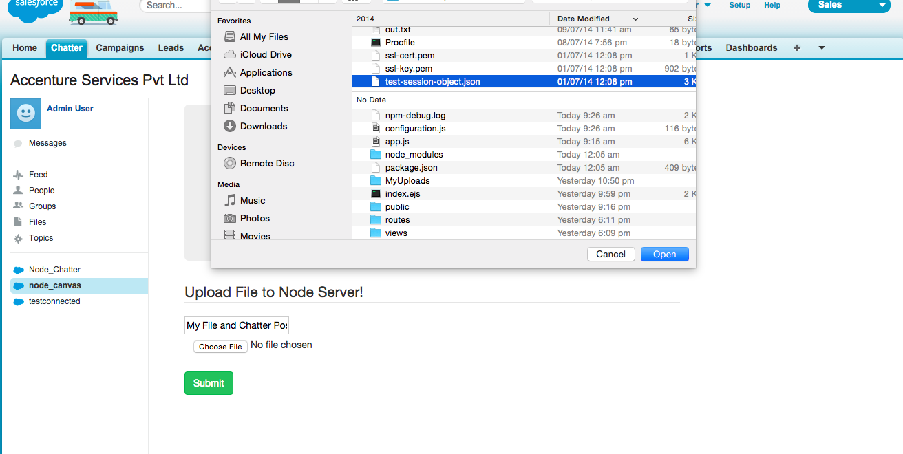
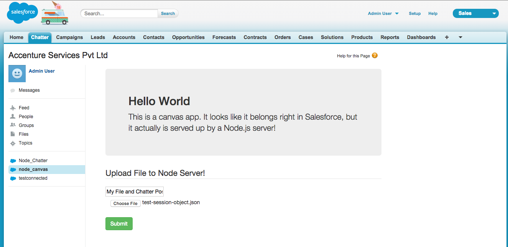
4. After we click on **Submit** button a chatter feed will be available under the feeds link as well as the file will be added to the Node JS server under the folder **My Uploads** with the description you added.
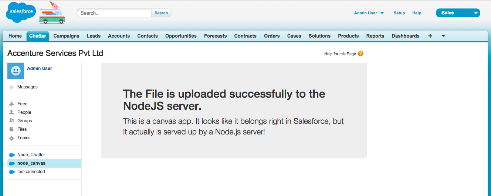

### **Visualforce page**
1. In your DE environment click **Your Name | Developer Console**
2. Select **File | New | Visualforce Page**
3. For the page name, enter **page_canvas** and click the **OK** button
4. Immediately above the closing `</apex:page>` tag, add the following markup create a Canvas app:

<apex:canvasApp applicationName="node_canvas" height="400px" width="750px"/> 

> The above code snippet is an example of how to display a canvas app on an Account page. The code specifies the size of the canvas app to be 400 pixels high and 750 pixels wide. This examples specifies the canvas app using the applicationName.
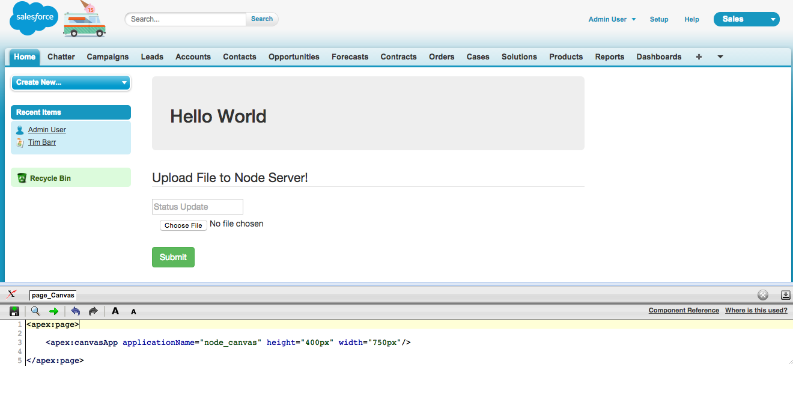
